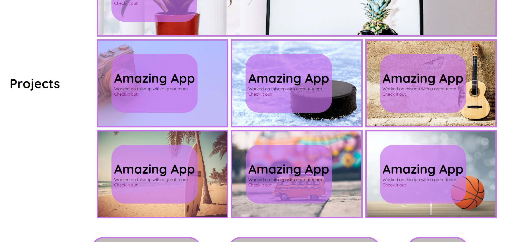

# Portfolio Website for Philip Curtis
## Description
This project was undertaken as part of a coding bootcamp. This is the second challenge of the rutgers bootcamp. We needed to create a portfolio website that has a nav bar that links to the different sections. As well as create a grid for the projects I have created that links to the projects. 

## Installation
If you wish to run this project locally on your own computer, assuming you have git installed, input the following code in your terminal.
git clone https://github.com/philcurtis4/portfolio_website_two

## Usage
The live site may be viewed at the following url.
https://YOUR_USERNAME.github.io/REPO_NAME/
Here is a screenshot of the page.

    
    
## Credits
I created this webpage from scratch.
I followed this guide to create this README.md file
https://coding-boot-camp.github.io/full-stack/github/professional-readme-guide
## License
This project has a MIT License. For more information read the LICENSE file.
---